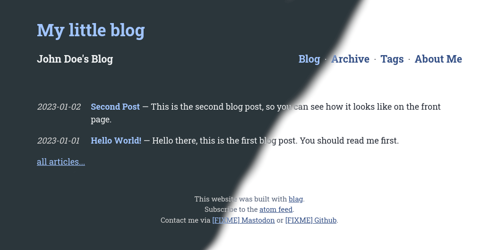

# Welcome to blag!

blag is a blog-aware, static site generator, written in [Python][].

* an example "deployment" can be found [here][venthur.de]
* online [documentation][] is available on https://readthedocs.org.

blag is named after [the blag of the webcomic xkcd][blagxkcd].

[python]: https://python.org
[blagxkcd]: https://blog.xkcd.com
[venthur.de]: https://venthur.de
[documentation]: https://blag.readthedocs.io/en/latest/


## Features

* Write content in [Markdown][]
* Good looking default theme:
  
* Theming support using [Jinja2][] templates
* Generation of Atom feeds for blog content
* Fenced code blocks and syntax highlighting using [Pygments][]
* Integrated devserver
* Available on [PyPI][]

blag runs on Linux, Mac and Windows and requires Python >= 3.10

[markdown]: https://daringfireball.net/projects/markdown/
[jinja2]: https://palletsprojects.com/p/jinja/
[pygments]: https://pygments.org/
[pypi]: https://pypi.org/project/blag/


## Install

blag is available on [PyPI][], you can install it via:

```bash
$ pip install blag
```

On Debian or Ubuntu, you can also just install the Debian package:

```bash
$ sudo aptitude install blag
```


## Quickstart

```bash
$ pip install blag                  # 1. install blag
$ blag quickstart                   # 2. create a new site
$ vim content/hello-world.md        # 3. create some content
$ blag build                        # 4. build the website
```
